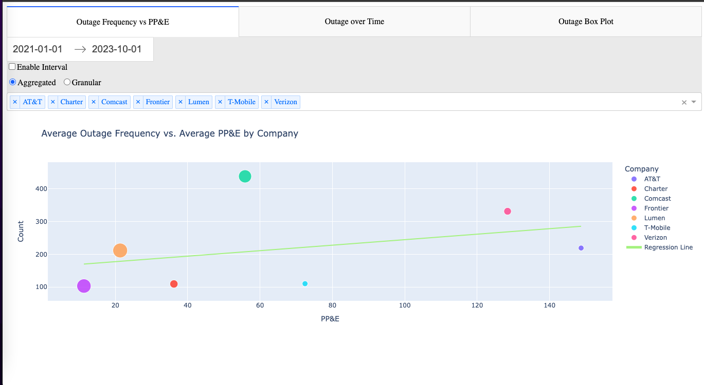
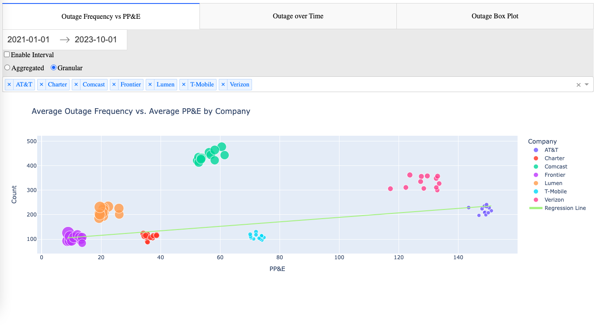
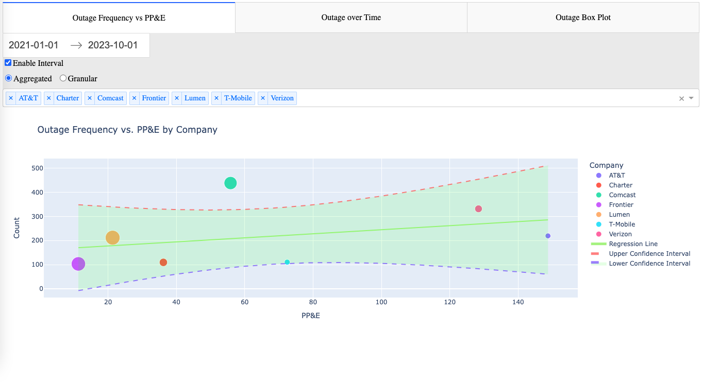
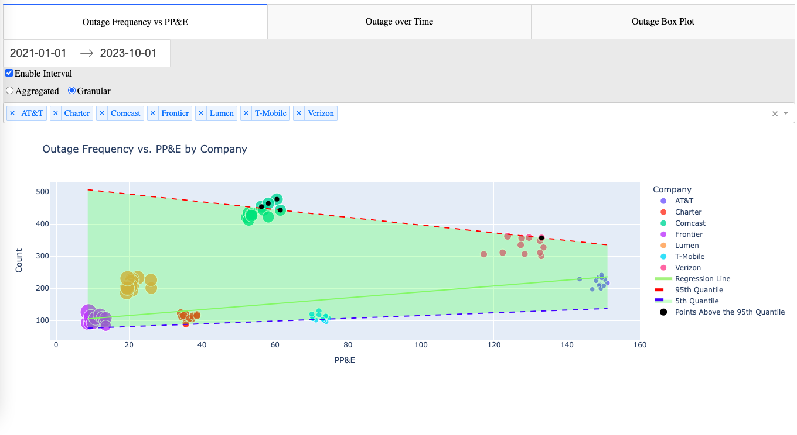
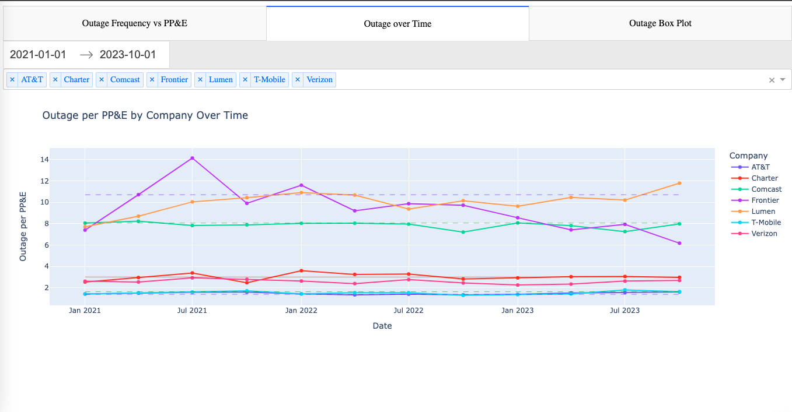

# Outage Dashboard Application

## Overview

The Outage Dashboard application provides two primary key functions:
- **Links Outage Data and Financial Data**: Integrates outage data and financial data from S&P Capital IQ and processes the linked data through custom modules.
- **Visualizes Processed Data**: Sets up an interactive web-based dashboard and automatically opens this dashboard in a user's default web browser.

## Table of Contents

1. [Overview](#overview)
2. [Prerequisites](#prerequisites)
3. [Obtaining S&P Financial Data](#obtaining-sp-financial-data)
4. [Obtaining NORS Data](#obtaining-nors-data)
5. [Installation](#installation)
6. [Usage](#usage)
7. [Dashboard Features](#dashboard-features)
8. [Code Documentation](#code-documentation)

## Prerequisites

Before running this application, ensure the following dependencies are installed:

- Dash
- Plotly
- Pandas
- scipy
- statsmodels
- faker
- chardet

Install these Python packages via pip:

```bash
pip install dash plotly pandas scipy statsmodels faker chardet
```

Ensure you have the following project-specific packages:

- `frontend`: Handles the creation of the Dash layout and the registration of callbacks.
- `visualization`: Contains the `PlotlyVisualizer` class for creating visualizations.
- `data_prep`: Manages the preparation and cleaning of data.

Financial data from the S&P Capital IQ Pro database is required. See the next section for detailed steps on how to obtain this data.

## Obtaining S&P Financial Data

Follow the steps provided [here](docs/S&P.md).

Note that the file will have to look something like this:


## Obtaining NORS Data

You can obtain the NORS dataset only if you're affiliated with the FCC. For testing purposes, you can generate fake outage data in the `fake_data_generator.ipynb` file in the datasets folder. If you do have the real NORS outage data, place the CSV file in the `datasets` directory.


## Installation

1. **Download or Clone the Repository**:
   Clone the source code from your repository or download the project folder containing all the necessary files and packages.

2. **Environment Setup**:
   Set up a Python environment and install the required dependencies as listed in the prerequisites. If you're not familiar with setting up a Python environment, click [here](docs/environment.md) for a more detailed guide.

## Usage

This section describes how to use the Dash web application and the standalone data preprocessor.

### Running the Data Preprocessor

The data preprocessor can be run independently to prepare your data before visualization. This can be especially useful if you choose to visualize the data through a more user-friendly data visualization tool such as **PowerBI** or **Tableau**. To execute the data preprocessor, provide the necessary file specifications:

```bash
python prepare_data.py --directory "datasets" --outage_file "outage_data.csv" --ppe_file "ppe.xlsx"
```

### Running the Dashboard

To launch the dashboard, specify the paths to the outage and PP&E data files. Use this command to run the dashboard:

```bash
python dashboard.py --directory "datasets" --outage_file "outage_data.csv" --ppe_file "ppe.xlsx"
```

If you don't want to use the terminal directly, you can use these commands in a Jupyter Notebook file. Open `app.ipynb` and run the cell that contains the data preparation and dashboard commands.

### Tips for Running Scripts

- Ensure that Python and all required libraries (as listed in the Prerequisites section) are properly installed in your environment.
- Check that the specified data files exist in your directory before running the commands to avoid errors.

## Dashboard Features

### Note: The data used here was randomly generated. The visualizations in the screenshots were not created from real outage data.

The dashboard is designed to provide interactive data visualization and analysis tools. Here are some of the key features:

### Interactive Data Filtering
Users can filter data based on company, date range, and other criteria to customize the visualizations. This feature is available for every visualization.

### Regression Analysis
This feature offers statistical visualizations that allow users to explore trends in their data. The toggle switch allows users to choose between two modes:

#### Aggregated View
Visualizes each company as an individual data point, simplifying the overall trends in the dataset.



#### Granular View
Displays data quarterly, providing a detailed view of outage data.



### Additional Analytical Tools

#### 95% Confidence Intervals
Available in the aggregated view to estimate the reliability of the observed trends.



#### Quantile Regression Upper and Lower Bound Lines
Accessible in the granular view, includes the 95th quantile line and the 5th quantile line.



**Note:** The original developer of this project is not a Statistician, so it may be possible that the data does not fully satisfy the assumptions required for linear regression confidence intervals or quantile regression upper and lower bound lines. This section is provided for illustrative purposes and is subject to change.

### Outage Trends Over Time

Shows how outage performance metrics change over time, which helps with identifying trends. Also includes lines for quartiles, median, 5th percentile, and 95th percentile.



### Boxplot Analysis

Utilizes boxplots to summarize the distribution of outage data across different companies.


## Code Documentation

- **`frontend`**: Package defining the Dash layout and registering callbacks. [More Info](frontend/README.md)
- **`visualization`**: Package for visualizing the prepared data. [More Info](visualization/README.md)
- **`data_prep`**: Package for preparing and cleaning data. [More Info](data_prep/README.md)
