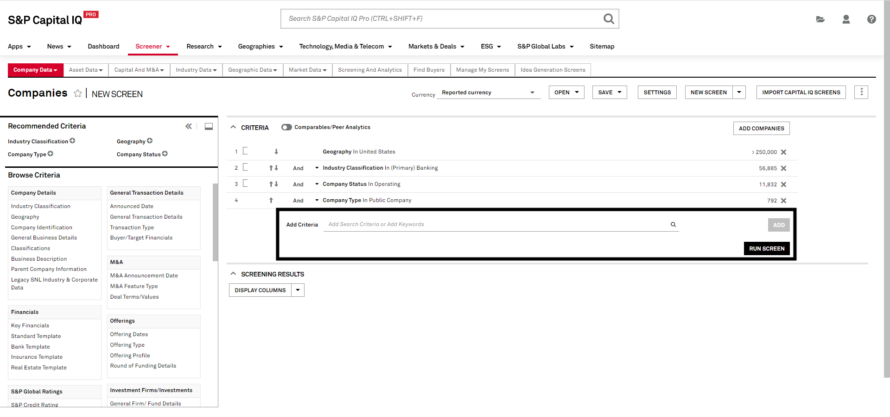

# Obtaining the S&P financial data

## Note:
Please note that the original creator of this document did not have access to the S&P Capital IQ Pro database while writing it. As such, the instructions may be imprecise. Feel free to revise this document to create a more detailed and comprehensive guide!

## Steps to get the financial data:

### Step 1.
Log into the website, click the screener tab, and then click on 'company'

### Step 2.
Click Company Data

### Step 3.
Once you navigate to 'Company Data', you can locate and click on the 'Add Criteria' option to include specific companies in your search.

### Step 4.
Once you have added all the companies into your criteria, navigate to and click the 'display columns' button.

### Step 5.
Upon clicking the 'Display Columns' button, a field selector menu will appear, which will allow you to search for specific financial metrics like PP&E. After selecting the desired metric, ensure you choose the 'calendar time periods' option, as the default setting may display fiscal year, quarter, etc.

### Step 6.
After setting up your criteria and selecting your desired output columns, click "RUN SCREEN" to execute the query and retrieve the data.

### Step 7. 
Press the 'Export' button to download the Excel file. Once the download is complete, place the file in the 'datasets' folder.
